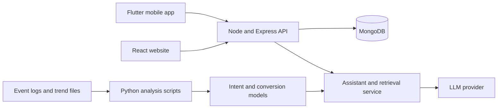

# Architecture and Technical Overview

**Team:** <Team Name> · **Solution:** PSK Session Intelligence

## 1. High-level diagram

## 2. Major components

| Component | Responsibility | Location |
|---|---|---|
| Mobile app | Player-facing UI and on-device assistant | `src/app/` |
| Website | Player-facing web UI | `src/web/` |
| API | Business logic and data access | `src/api/` |
| Analysis | Data cleaning, pattern mining, model training | `src/analysis/` |

## 3. Data flows

1. <Event, ingestion, feature, decision, UI>
2. <Assistant query, retrieval, response>

## 4. External dependencies

- LLM provider: <name and endpoint>
- Database: MongoDB <version>
- <Other SDKs or services>

## 5. Deployment assumptions

- Runs on a reviewer machine by following the README steps.
- <Container or cloud target for production>
- Secrets are supplied through environment variables only.

## 6. Security considerations

- No credentials in the repository. `.env` is git-ignored.
- <Authentication, input validation, rate limiting>
